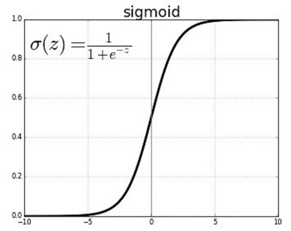

*********************
Logistic Regression
*********************

Logistic Regression can be defined as an algorithm for binary classification, which is a function that outputs either 0 or 1. For example, consider a function that determines if a picture contains a face. The function outputs a 1 if it contains a face or 0 if it does not contain a face. The notation for Logistic regression is described by the following:

##################
##################
.. contents::
  :local:
  :depth: 3

---------------
Notation
---------------
| (x, y) --> input and output of a single training item
| x ∈ R\ :sub:`n`\ x --> x is a nx dimensional feature vector
| y ∈ {0,1} --> y is 0 or 1
| {(x\ :sup:`(1)`\ , y\ :sup:`(1)`\ ), (x\ :sup:`(2)`\ , y\ :sup:`(2)`\ ),…, (x\ :sup:`(m)`\ , y\ :sup:`(m)`\ )} --> set of m training items
| X --> capital X defines a n\ :sub:`x`\  by m matrix with columns being x\ :sup:`(1)`\ , x\ :sup:`(2)`\ ,…, x\ :sup:`(m)`\
| Y --> capital Y defines a 1 by m matrix with columns being y\ :sup:`(1)`\ , y\ :sup:`(2)`\ ,…, y\ :sup:`(m)`\

--------------
Sigmoid
--------------
Given x, ŷ describes the probability that y is 1. This is equated as ŷ = P(y = 1 | x) and 0 ≤ ŷ ≤ 1. The parameters w and b where w ∈ R\ :sup:`x`\ and b ∈ R give the sigmoid function ŷ = σ(w\ :sup:`T`\ + b). The sigmoid function’s output spans from 0 to 1 whereas only using ŷ = w\ :sup:`T`\ + b (used for basic linear regression) does not. The function is denoted as σ(z) with z being w\ :sup:`T`\ + b. Looking at the equation in the graph below, the larger the value of z, the closer to 1 the function output will be. The smaller the value of z, the closer to 0 the function output will be.

----------------------
Cost Functions
----------------------
With logistic regression, we want ŷ\ :sup:`(i)`\ to be as close to y\ :sup:`(i)`\ as possible, and cost functions quantify this accuracy. A loss function is one that describes accuracy of a singular training item whereas a cost function describes the accuracy of the whole training set because the cost is the average loss of all training items. The loss or error function L(ŷ, y) = ½ (ŷ - y)\ :sup:`2`\ does not work well with gradient descent because the graph can create multiple extrema, and we want to work towards a single minimum. Thus being said, the loss function L(ŷ, y) = -(ylog(ŷ) + (1 - y)log(1 - ŷ)) is a much better option because it creates a convex graph, meaning there is one single minimum.

Cost function:  J(w, b) = 1/m ∑\ :sup:`m`\ \ :sub:`i=0`\  L(ŷ(i), y(i)) = -1/m ∑\ :sup:`m`\ \ :sub:`i=0`\  [ylog(ŷ) + (1 - y)log(1 - ŷ)]

The goal here is to find parameters w and b that minimize the cost function. This process is called gradient descent and will be discussed in the next section.

.. _Deriv: DerivativesAndChainRule.rst
`Next Section: Derivatives and the Chain Rule <Deriv_>`_ 

