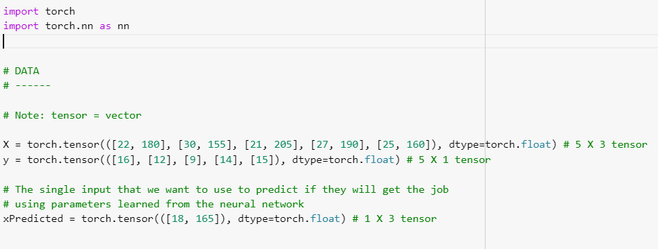

****************************
Neural Networks Architecture
****************************

##################
##################
.. contents::
  :local:
  :depth: 8

==========================
What is a neural network?
==========================
Neural networks are computing systems that are modeled after the brains of living animals. They consist of neurons that are all connected to create a network. These systems "learn" from data that is provided to them. By providing neural networks with enough data, they are capable of making accurate predictions by training and learning from the data.

==========================
The Basics
==========================
The function of neural networks is fairly straightforward and basic. An input is provided to the network, and after some calculations are made, an output is returned. For example, if we wanted to have a program that could determine if there is a dog in a picture then the input to the neural network would be a picture, and the output would be true or false based on whether the network thinks the picture contains a dog or not.

In order for neural networks to be able to make these predictions, they must be given data to train. Training a neural network involves providing a large amount of input data and it's corresponding output data. Neural networks are able to make calculations to infer relationships between the inputs and outputs, and create a system for accurately being able to predict an outcome when only given an input.

==========================
Architecture
==========================
The architecture that is behind neural networks is always fairly straightforward. While there are many different types of architectures 
that are used for getting more accurate predictions in specific scenarios, they all involve input nodes and an output node, or "neuron". The input neurons take data about a scenario, and multiple layers on the "inside" of the network calculate what the outcome will be. What makes a neural network "deep" is when there are more than a single layer of neurons between the input and output neurons, as can be seen below. 

.. figure:: _img/neuralnetwork.jpeg

================================
Code for a Simple Neural Network
================================
To begin writing code with the PyTorch library, it is important to ensure that you have imported torch at the beginning of your python program. 

--------------------------------
Step 1: Data
--------------------------------
The first step in writing code to create any neural network is to either create or import the data that is going to be used to train your model. In this case, we will be creating our own training and test data. The X tensor below represents an individuals age and weight as the input to our network, and the Y tensor represents the maximum speed that the individual can run in MPH, the output. xPredicted is what we will use to test our neural network after it has been trained.

.. code:: python

import torch
import torch.nn as nn
X = torch.tensor(([2, 9], [1, 5], [3, 6]), dtype=torch.float) # 3 X 2 tensor
y = torch.tensor(([92], [100], [89]), dtype=torch.float) # 3 X 1 tensor

# Single input that we want to use to predict a grade using parameters learned from the neural network
xPredicted = torch.tensor(([4, 8]), dtype=torch.float) # 1 X 2 tensor

--------------------------------
Step 2: Scaling
--------------------------------
Now that we have our data, we must scale it in order to make sure that our data is in a proper format to train our network.

.. figure:: _img_simple_code/2.PNG

---------------------------------
Step 3: Model (Computation Graph)
---------------------------------
When writing any simple neural network using PyTorch, it is recommended to define our model via a class. Our class header contains the name of the class and the parameter, which together define that we are creating a neural network. We then initialize our neural network. 

.. figure:: _img_simple_code/3.PNG

-------------------------------------
Step 4: Forward Pass/Backpropagation
-------------------------------------
Being new to building neural networks, these concepts can be hard to grasp, and we will go further into them both later on in this course. For now, you just need to understand what their purpose is in this code. 

The forward function is where the data is entered and fed into the computation graph. This function performs linear calculations to obtain an output for our netowrk.

The backpropagation function is used to minimize loss with respect to our weights when training.

.. figure:: _img_simple_code/4.PNG

-------------------------------------
Step 5: Activation Functions
-------------------------------------
Below are functions that represent in code we we have discussed earlier in this course, such as the sigmoid function. These are used in the forward pass. 

.. figure:: _img_simple_code/5.PNG

-------------------------------------
Step 6: Train
-------------------------------------
Now that we have created our model, all that is left to do is train it and make a prediction!

.. figure:: _img_simple_code/6.PNG

=============
References
=============
This tutorial was inspired by the tutorial provided at https://medium.com/dair-ai/a-simple-neural-network-from-scratch-with-pytorch-and-google-colab-c7f3830618e0 created by Elvis on August 13, 2018. 

=============
Code
=============
.. _nnCode: simpleneuralnetwork.py
`Full Code <nnCode_>`_

=============
Next Section
=============
.. _simpleLog: SimpleLogisticRegression.rst
`Next Section: Simple Logistic Regression <simpleLog_>`_ 

