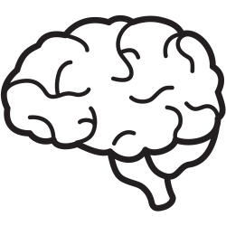
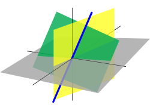

###################################################
A Deep Learning Course with PyTorch
###################################################

.. image:: https://img.shields.io/badge/contributions-welcome-brightgreen.svg?style=flat
    :target: https://github.com/pyairesearch/machine-learning-for-everybody/pulls
.. image:: https://badges.frapsoft.com/os/v2/open-source.png?v=103
    :target: https://github.com/ellerbrock/open-source-badge/
.. image:: https://img.shields.io/badge/Made%20with-Python-1f425f.svg
      :target: https://www.python.org/
.. image:: https://img.shields.io/badge/book-pdf-blue.svg
   :target: https://machinelearningmindset.com/wp-content/uploads/2019/06/machine-learning-course.pdf

##################
Table of Contents
##################
.. contents::
  :local:
  :depth: 4

================================================
Download Free Deep Learning Resource Guide
================================================

.. raw:: html

   

.. raw:: html

  

.. raw:: html

   

========================
Introduction
========================

The purpose of this project is to provide a comprehensive and yet simple course in Deep Learning using the PyTorch framework.

.. You can access to the full documentation with the following links: |Book| |Documentation|

.. .. |Book| image:: https://img.shields.io/badge/book-pdf-blue.svg
   :target: https://machinelearningmindset.com/wp-content/uploads/2019/06/machine-learning-course.pdf
.. .. |Documentation| image:: https://img.shields.io/badge/official-documentation-green.svg
   :target: https://machine-learning-course.readthedocs.io/en/latest/

============
Motivation
============

``Deep Learning``, as a tool for ``Artificial Intelligence``, has become increasingly popular in the industry of data science due to the ability to teach computers to learn by example. It is the driving technology behind modern autonomous vehicles as well as natural language processing. A considerable amount of literature has been published on Deep Learning.
The purpose of this project is to provide the most important aspects of ``Deep Learning`` by presenting a
series of simple and yet comprehensive tutorials using the ``PyTorch`` framework.In this project you will learn:

* What is Deep Learning?
* What are the basics of the linear algebra that make Deep Learning possible?
* What are the basics Neural Networks and how do they work?
* What can I learn more about Neural Networks?

=============
Deep Learning
=============

------------------------------------------------------------
Introduction to Deep Learning
------------------------------------------------------------

.. _what: What.rst
.. _why: Why.rst
.. _applications: Applications.rst

.. _dtdoc: docs/source/content/supervised/decisiontrees.rst
.. _dtcode: code/supervised/DecisionTree/decisiontrees.py

+--------------------------------------------------------------------+-------------------------------+
| Title                                                              |    Document                   |
+====================================================================+===============================+
| What is Deep Learning?                                             | `Tutorial <what_>`_           |
+--------------------------------------------------------------------+-------------------------------+
| Why Deep Learning?                                                 | `Tutorial <why_>`_            |
+--------------------------------------------------------------------+-------------------------------+
| Applications                                                       | `Tutorial <applications_>`_   |
+--------------------------------------------------------------------+-------------------------------+

------------------------------------------------------------
Basics
------------------------------------------------------------

.. _LogReg: LogisticRegression.rst
.. _GradDec: gradientDescent.rst
.. _Dev: DerivativesAndChainRule.rst

.. _architecture: NeuralNetworksArchitecture.rst
.. _architecturecode: simpleneuralnetwork.py

.. _regression: SimpleLogisticRegression.rst
.. _regressioncode: logisticregression.py

+--------------------------------------------------------------------+-------------------------------+
| Title                                                              |    Document                   |
+====================================================================+===============================+
| Logistic Regression                                                |  `Tutorial <LogReg_>`_        |
+--------------------------------------------------------------------+-------------------------------+
| Derivatives and the Chain Rule                                     |  `Tutorial <Dev_>`_           | 
+--------------------------------------------------------------------+-------------------------------+
| Gradient Descent                                                   |  `Tutorial <GradDec_>`_       |
+--------------------------------------------------------------------+-------------------------------+

+--------------------------------------------------------------------+-------------------------------+--------------------------------+
| Title                                                              |    Code                       |    Document                    |
+====================================================================+===============================+================================+
| Simple Neural Networks                                             | `Code <architecturecode_>`_   | `Tutorial <architecture_>`_    |
+--------------------------------------------------------------------+-------------------------------+--------------------------------+
| Simple Logistic Regression                                         | `Code <regressioncode_>`_     | `Tutorial <regression_>`_      | 
+--------------------------------------------------------------------+-------------------------------+--------------------------------+

------------------------------------------------------------
Neural Networks
------------------------------------------------------------

.. figure:: _img/neuralnetwork.jpg

.. _over: overview.rst
.. _comp: computation.rst
.. _acti: activationFunctions.rst
.. _back: backpropagation.rst

+--------------------------------------------------------------------+--------------------------------+
| Title                                                              |    Document                    |
+====================================================================+================================+
| Overview                                                           |    `Tutorial <over_>`_         | 
+--------------------------------------------------------------------+--------------------------------+
| Computation                                                        |    `Tutorial <comp_>`_         |
+--------------------------------------------------------------------+--------------------------------+
| Activation Functions                                               |    `Tutorial <acti_>`_         |
+--------------------------------------------------------------------+--------------------------------+
| Backpropagation                                                    |    `Tutorial <back_>`_         |
+--------------------------------------------------------------------+--------------------------------+

------------------------------------------------------------
More on Deep Neural Networks
------------------------------------------------------------

.. _reg: regularization.rst
.. _drop: dropout.rst
.. _gradSet: gradientSetbacks.rst
.. _batch: batchNormalization.rst

+--------------------------------------------------------------------+---------------------------+
| Title                                                              |    Document               |
+====================================================================+===========================+
| Regularization                                                     |     `Tutorial <reg_>`_    |
+--------------------------------------------------------------------+---------------------------+
| Dropout                                                            |     `Tutorial <drop_>`_   |
+--------------------------------------------------------------------+---------------------------+
| Gradient Setbacks                                                  |  `Tutorial <gradSet_>`_   |
+--------------------------------------------------------------------+---------------------------+
| Batch Normalization                                                |   `Tutorial <batch_>`_    |
+--------------------------------------------------------------------+---------------------------+

========================
Pull Request Process
========================

Please consider the following criterions in order to help us in a better way:

1. The pull request is mainly expected to be a link suggestion.
2. Please make sure your suggested resources are not obsolete or broken.
3. Ensure any install or build dependencies are removed before the end of the layer when doing a
   build and creating a pull request.
4. Add comments with details of changes to the interface, this includes new environment
   variables, exposed ports, useful file locations and container parameters.
5. You may merge the Pull Request in once you have the sign-off of at least one other developer, or if you
   do not have permission to do that, you may request the owner to merge it for you if you believe all checks are passed.

========================
Contact Us
========================

We are looking forward to your kind feedback. Please help us to improve this open source project and make our work better.
For contribution, please create a pull request and we will investigate it promptly. Once again, we appreciate
your kind feedback and support.

Please feel free to contact any of the developers for any feedback, questions, and concerns.

========================
Developers
========================
+-------------------+---------------------+
| Developers        | Email               |
+===================+=====================+
| Sam Burton        | samb7@vt.edu        |
+-------------------+---------------------+
| Matt Robinson     | rmatt21@vt.edu      | 
+-------------------+---------------------+
| Andrew Whelan     | wandrew8@vt.edu     |
+-------------------+---------------------+
| Harrison Ellis    | harry16@vt.edu      |
+-------------------+---------------------+
| Brendan Bolon     | brendb98@vt.edu     |
+-------------------+---------------------+

**Supervisor**: Amirsina Torfi [`GitHub
<https://github.com/astorfi>`_, `Personal Website
<https://astorfi.github.io/>`_, `Linkedin
<https://www.linkedin.com/in/amirsinatorfi/>`_ ]

**NOTE**: This project has been developed as a capstone project offered by [`CS 4624 Multimedia/ Hypertext course at Virginia Tech <https://vtechworks.lib.vt.edu/handle/10919/90655>`_] and
Supervised and supported by [`Machine Learning Mindset <https://machinelearningmindset.com/>`_].

\*: equally contributed

========================
Image Sources
========================
1. https://www.clipart.email/clipart/cartoon-simple-clipart-brain-392244.html
2. https://towardsdatascience.com/machine-learning-fundamentals-ii-neural-networks-f1e7b2cb3eef
3. https://en.wikipedia.org/wiki/Linear_algebra
4. https://stockadobe.com/184422188

======================
Citation
======================

If you found this course useful, please kindly consider citing it as below:

.. code:: shell

    @software{amirsina_torfi_2019_3585763,
      author       = {Amirsina Torfi and
                      Samuel Burton and
                      Matt Robinson and
                      Andrew Whelan and
                      Harrison Ellis and
                      Brendan Bolon},
      title        = {{machinelearningmindset/machine-learning-course: 
                       Machine Learning with Python}},
      month        = april,
      year         = 2020,
      publisher    = {},
      version      = {1.0},
      doi          = {10.5281/zenodo.3585763},
      url          = {}
    }
