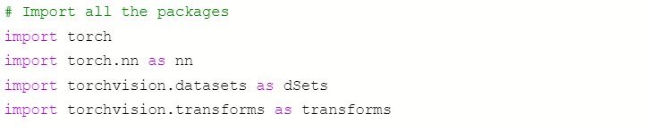
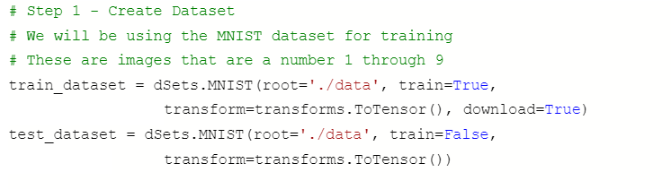
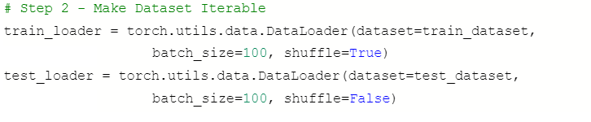
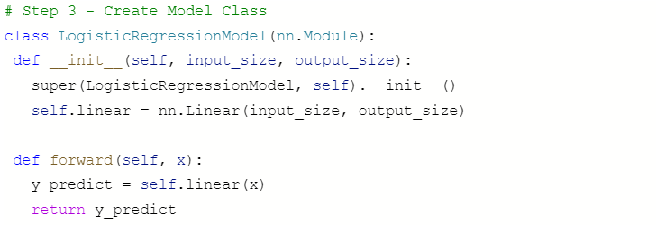
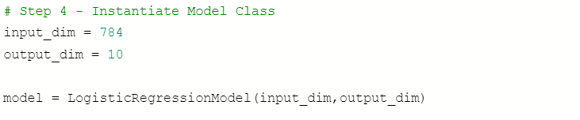
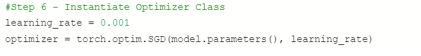
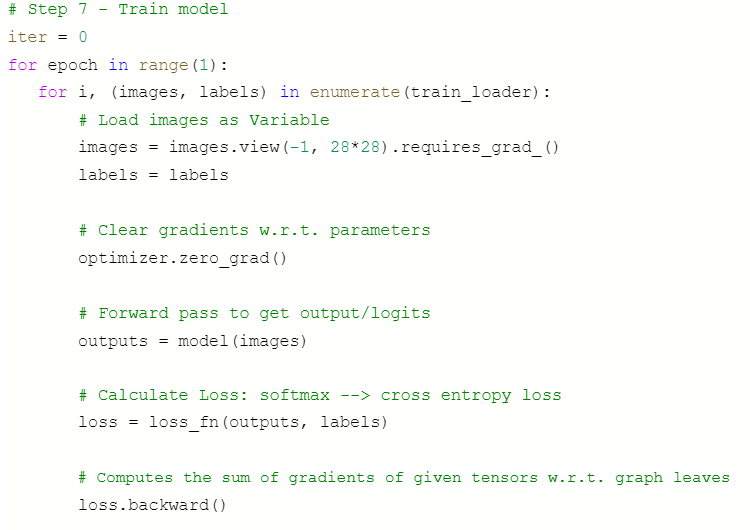
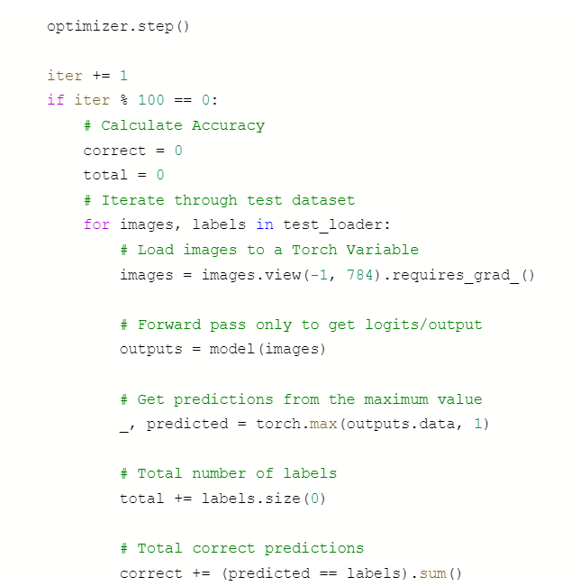
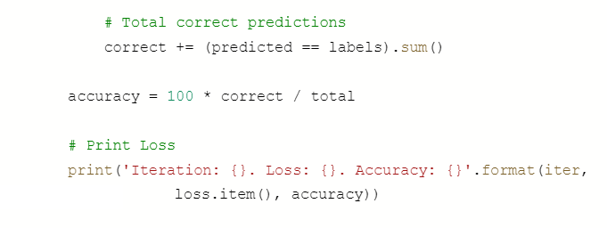

**************************************
Logistic Regression Code Documentation
**************************************

##################
##################
.. contents::
  :local:
  :depth: 5

----------------------------
Step 0: Import libraries
----------------------------
Import the PyTorch libraries needed to train a logistic regression model. We also needed to import torchvision, 
which is a package that consists of popular datasets and image transformations for computer vision.

--------------------------------
Step 1: Create Dataset
--------------------------------
The first step of developing a logistic regression model is to find a dataset of interest. This can be created on your own
or can be loaded from any public data source. In this case, we chose to load the MNIST data set from the torchvision package. 
This dataset contains thousands of handwritten numbers from 1 to 9. Our goal is to train a logistic regression model that is 
able to decipher each handwritten digit.

--------------------------------
Step 2: Make Dataset Iterable
--------------------------------
The next step is to make sure that we can iterate through the dataset that we just loaded. The PyTorch DataLoader function makes this step very simple.

---------------------------------
Step 3: Create Model Class
---------------------------------
Now, we need to create a class that defines the architecture of linear regression. This class is going to include the initialization of our model as well as a definition for our forward propagation. Forward propagation refers to the calculation and storage of intermediate variables (including outputs) for the neural network in order from the input layer to the output layer.

-------------------------------------
Step 4: Instantiate Model Class
-------------------------------------
Next, we initialize the model class by importing our input and output dimensions into the logistic regression model. The input dimension is 784 because each image within the data set has 784 pixels (28*28). The output dimension is 10 because we are trying to determine what digit the handwritten picture depicts (0-9).

-------------------------------------
Step 5: Instantiate Loss Class
-------------------------------------
We then initialize the loss class by using CrossEntropyLoss to compute loss. CrossEntropyLoss measures the performance of a classification model whose output is a probability value between 0 and 1.

.. figure:: img_regression_code/5.PNG

-------------------------------------
Step 6: Instantiate Optimizer Class
-------------------------------------
The optimizer represents the learning algorithm that we have selected to use. In this case we have decided to use Stochastic Gradient Descent (SGD). 

-------------------------------------
Step 6: Train Model
-------------------------------------
The final step in this linear regression is to train the regression model. During this step, we iterate through the images. As we move from image to image, we make the image a variable, clear unneeded parameters and then send the image into the logistic regression model as a parameter. From there, we are able to calculate loss using the loss function, call PyTorch’s back propagation function and update the parameters for the next image using the optimizer. Lastly, we provide a chunk of code that calculates an accuracy value and displays the loss and accuracy values for every hundredth iteration.

-------------------------------------
Example Output
-------------------------------------
This shows an output from one of our executions. The results display that after each set of 100 iterations, our logistic regression model becomes more accurate, which was the ultimate goal of the model.
Iteration: 100. Loss: 2.2325596809387207. Accuracy: 20
Iteration: 200. Loss: 2.1107139587402344. Accuracy: 33
Iteration: 300. Loss: 2.03490948677063. Accuracy: 47
Iteration: 400. Loss: 1.9995723962783813. Accuracy: 57
Iteration: 500. Loss: 1.884688138961792. Accuracy: 64
Iteration: 600. Loss: 1.8383146524429321. Accuracy: 68

-------------------------------------
References
-------------------------------------
- https://d2l.ai/chapter_multilayer-perceptrons/backprop.html
- https://towardsdatascience.com/logistic-regression-on-mnist-with-pytorch-b048327f8d19
- https://www.deeplearningwizard.com/deep_learning/practical_pytorch/pytorch_logistic_regression/
- https://pytorch.org/docs/stable/torchvision/datasets.html#mnist
