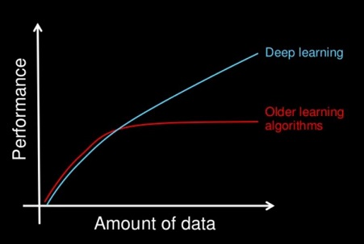

**********************
Why Deep Learning?
**********************

Why use deep learning rather than machine learning or other predictive algorithms? In recent years deep learning has better performance than other learning algorithms when trained with large data sets.

##################
##################
.. contents::
  :local:
  :depth: 4

----------
**Data**
----------
Smartphones, social media, and the scale of the internet today has allowed for gathering more data than ever before. Traditional learning algorithms show success in predicting outcomes when trained with data however these learning algorithms do not see increased performance past a certain size of data set. Neural networks showed better performance overtime with larger amounts of data than traditional learning algorithms, however deep learning algorithms with large neural networks showed the greatest increase in performance with access to more data. The access and quantity of data today have made deep learning algorithms the most attractive learning algorithm.

-----------------
**Computation**
-----------------
Another reason for the popularity and use of deep learning is the technological innovations made in the field of computing. Training a deep learning algorithm has historically been an expensive and time consuming process. However, the costs of implementation, use, and training have been dropping. With stronger processing and computational power, deep learning has become more a more viable option than ever before.

--------------------------------
**Advancements in Algorithms**
--------------------------------
Deep learning's popularity has also been fueled by advancements in learning algorithms in recent years. With better algorithms for neural networks, deep learning algorithms have shown a vast improvement in performance and efficiency. One example of these advancements is the use of ReLU functions rather than sigmoid functions. ReLU functions have proved more efficient than sigmoid functions by reducing the likelihood of a gradient to vanish which is a major cause of inefficiency in deep learning algorithms.

--------------
References
--------------
1. https://www.coursera.org/specializations/deep-learning
2. https://machinelearningmastery.com/what-is-deep-learning/

.. _Applications: Applications.rst
`Next Section: Applications <Applications_>`_ 

