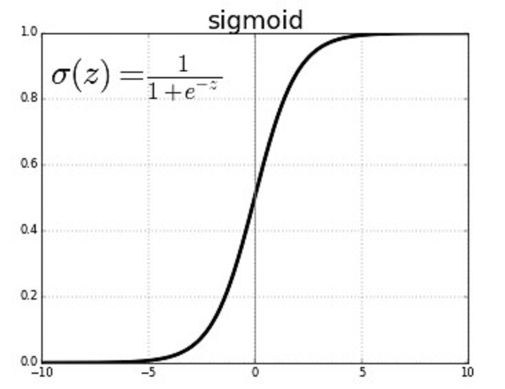
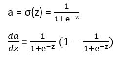
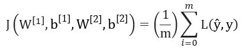

*********************
Backpropagation
*********************

When performing gradient descent, backpropagation is used to determine how you change the parameters to move towards the optimal point. Backpropagation describes the process of finding derivatives of the cost function using the chain rule until you reach the derivatives of w and b. The slope of these parameters determines which direction they are incremented.

##################
##################
.. contents::
  :local:
  :depth: 3

---------------
Sigmoid Review
---------------

As discussed in the Linear Regression tutorial, the sigmoid function is a = σ(z), where z = w\ :sup:`T`\x+ b. The following describes the derivation of this function:

Here we can see that da/dz = a (1 – a).

-----------------------------
Backpropagation Example
-----------------------------
Consider a neural network with one hidden layer. The parameters will be the matrices W\ :sup:`[1]`\, b\ :sup:`[1]`\, W\ :sup:`[2]`\, and b\ :sup:`[2]`\. The cost function will be the following equation:

In this equation, ŷ is interchangeable with a\ :sup:`[2]`\ because it is our last a value. The values you are trying to find through backpropagation here are dw\ :sup:`[1]`\ and db\ :sup:`[1]`\ so that you can update w and b accordingly for gradient descent. First you need to compute ŷ for the training examples through the following steps which are discussed in the previous section:

z\ :sup:`[1]`\  = W\ :sup:`[1]`\X + b\ :sup:`[1]`\

A\ :sup:`[1]`\  = σ(z\ :sup:`[1]`\)

z\ :sup:`[2]`\  = W\ :sup:`[2]`\A\ :sup:`[1]`\ + b\ :sup:`[2]`\

A\ :sup:`[2]`\  = σ(z\ :sup:`[2]`\) which is the set of every training example’s ŷ value

----------------------
Solving the example
----------------------
The following equations are used to solve the backpropagation in the above example:

dz\ :sup:`[2]`\  =  A\ :sup:`[2]`\ – Y where Y is the set of the y value of each training example

dw\ :sup:`[2]`\  = (1/m) dz\ :sup:`[2]`\ A\ :sup:`[1]T`\

db\ :sup:`[2]`\  = (1/m) Σ(dz\ :sup:`[2]`\) matrix summation

dz\ :sup:`[1]`\  = W\ :sup:`[2]T`\dz\ :sup:`[2]`\ * g’(Z\ :sup:`[1]`\) where g(Z\ :sup:`[1]`\) = σ(Z\ :sup:`[1]`\) and g’ is the derivative of g

dw\ :sup:`[1]`\  = (1/m) dz\ :sup:`[1]`\ X\ :sup:`T`\

db\ :sup:`[1]`\  = (1/m) Σ(dz\ :sup:`[1]`\) matrix summation

Now the you have taken the cost function and computed dw\ :sup:`[1]`\ and db\ :sup:`[1]`\ from it through back propagation, you are able update them and continue with gradient descent.

**Sources**
https://www.coursera.org/
