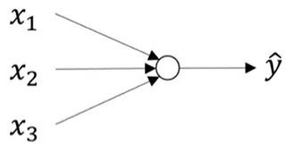

-----------
Computation
-----------

Remembering back to the logistic regression computations in the basics module, we discussed the sigmoid function ŷ = σ(z), where z = w\ :sup:`T`\x+ b, used to then compute the Loss function L(ŷ, y). A visual representation of what we were computing with logistic regression is shown below.

When computing a neural network, this logistic regression computation is repeated with each layer. Consider a = σ(z) on a layer instead of ŷ = σ(z). The figure below represents a small neural network. In the figure above, the initial parameters used to compute z are w and b. Here, the parameters in the first layer are W\ :sup:`[1]`\ and b\ :sup:`[1]`\ which give the equation z\ :sup:`[1]`\ = W\ :sup:`[1]`\x + b\ :sup:`[1]`\.
