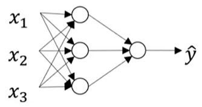

-----------
Computation
-----------

Remembering back to the logistic regression computations in the basics module, we discussed the sigmoid function ŷ = σ(z), where z = w\ :sup:`T`\x+ b, used to then compute the Loss function L(ŷ, y). A visual representation of what we were computing with logistic regression is shown below.

.. figure:: _img/computation.jpg

When computing a neural network, this logistic regression computation is repeated with each layer. Consider a = σ(z) on a layer instead of ŷ = σ(z). The figure below represents a small neural network. In the figure above, the initial parameters used to compute z are w and b. Here, the parameters in the first layer are W\ :sup:`[1]`\ and b\ :sup:`[1]`\ which give the equation z\ :sup:`[1]`\ = W\ :sup:`[1]`\x + b\ :sup:`[1]`\. The values z, W\ :sup:`[1]`\, and b\ :sup:`[1]`\ represent matrices composed of the z, w, and, b values from each node in the layer. For example, the top node of layer 1 in the figure below is described by the equation z1\ :sup:`[1]`\ = w1\ :sup:`[1]`\ Tx + b1\ :sup:`[1]`\.  The superscript [1] denotes the first layer, The subscript 1 denotes the first node in the layer. Similarly, the second 2nd node of layer 1 has the equation  z\ :sub:`2`\ \ :sup:`[1]`\ = w\ :sub:`2`\ \ :sup:`[1]`\ \ :sup:`T`\x + b\ :sub:`2`\ \ :sup:`[1]`\.The next step is to compute the ‘a’ for this layer with the equation a\ :sup:`[1]`\ = σ(z\ :sup:`[1]`\) which will be used in place of x for the following layer. Here, z\ :sup:`[1]`\ is a matrix so a\ :sup:`[1]`\ will be a matrix of the ‘a’ values for each node in the first layer. For instance, a\ :sub:`1`\ \ :sup:`[1]`\ = σ(z\ :sub:`1`\ \ :sup:`[1]`\]) in the first node and a\ :sub:`2`\ \ :sup:`[1]`\ = σ(z\ :sub:`2`\ \ :sup:`[1]`\) in the second node. To compute the z value of the 2nd layer, the equation z\ :sup:`[2]`\ = W\ :sup:`[2]`\a\ :sup:`[1]`\ + b\ :sup:`[2]`\ is used. Just like in layer one, the ‘a’ value for layer 2 is calculated as a\ :sup:`[2]`\ = σ(z\ :sup:`[2]`\). Since the example represented by the figure below has reached the end, a\ :sup:`[2]`\ and z\ :sup:`[2]`\ are real numbers instead of matrices and also a\ :sup:`[2]`\ becomes the ŷ therefore the Loss can be computed as L(a\ :sup:`[2]`\, y). For a network with more than 2 layers, repeat this process, finding a\ :sup:`[i]`\ for each layer until reaching the end.

