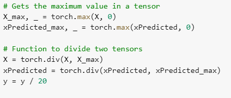
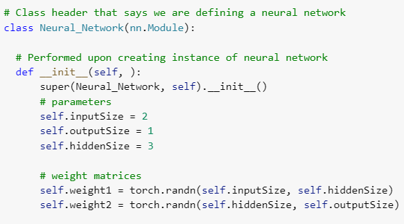
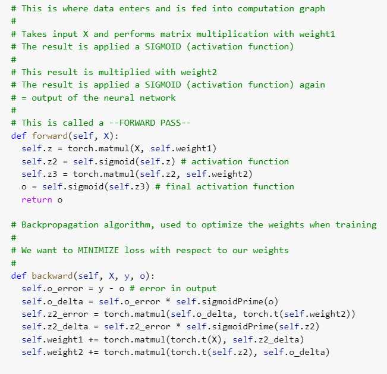
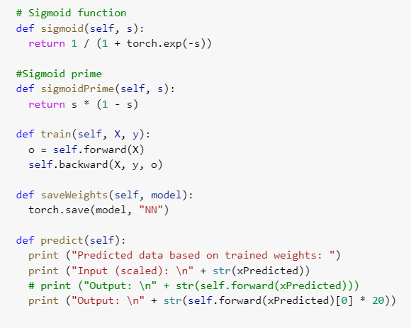
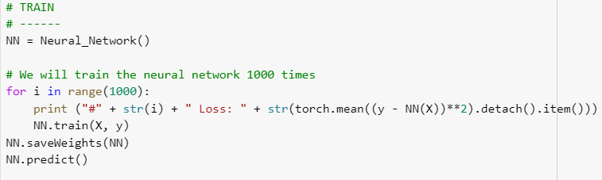

*************************
Neural Network Classifier
*************************

##################
##################
.. contents::
  :local:
  :depth: 8

==========================
Overview
==========================
Neural networks are computing systems that are modeled after the brains of living animals. They consist of neurons that are all connected to create a network. These systems "learn" from data that is provided to them. By providing neural networks with enough data, they are capable of making accurate predictions by training and learning from the data.

==========================
The Basics
==========================
The function of neural networks is fairly straightforward and basic. An input is provided to the network, and after some calculations are made, an output is returned. For example, if we wanted to have a program that could determine if there is a dog in a picture then the input to the neural network would be a picture, and the output would be true or false based on whether the network thinks the picture contains a dog or not.

In order for neural networks to be able to make these predictions, they must be given data to train. Training a neural network involves providing a large amount of input data and it's corresponding output data. Neural networks are able to make calculations to infer relationships between the inputs and outputs, and create a system for accurately being able to predict an outcome when only given an input.

============================
Convolutional Neural Network
============================
The architecture that is behind neural networks is always fairly straightforward. While there are many different types of architectures 
that are used for getting more accurate predictions in specific scenarios, they all involve input nodes and an output node, or "neuron". The input neurons take data about a scenario, and multiple layers on the "inside" of the network calculate what the outcome will be. What makes a neural network "deep" is when there are more than a single layer of neurons between the input and output neurons, as can be seen below. 

.. figure:: _img/neuralnetwork.jpeg

===========================================
Code for a Simple Neural Network Classifier
===========================================
To begin writing code with the PyTorch library, it is important to ensure that you have imported torch at the beginning of your python program. 

--------------------------------
Step 1: Data - CIFAR10
--------------------------------
Load and Nomralize CIFAR10 dataset
.. code-block:: python
    # The dataset consists of classes airplane, automobile, bird, cat, deer, dog, frog, horse, ship,        truck
    # The images in CIFAR-10 are of size 3x32x32 . i.e. 3-channel color images of 32x32 pixels in           size.
    import torch
    import torchvision
    import torchvision.transforms as transforms

--------------------------------
Step 2: Scaling
--------------------------------

---------------------------------
Step 3: Model (Computation Graph)
---------------------------------

-------------------------------------
Step 4: Forward Pass/Backpropagation
-------------------------------------

-------------------------------------
Step 5: Activation Functions
-------------------------------------

-------------------------------------
Step 6: Train
-------------------------------------

-------------------------------------
Step 7: Results
-------------------------------------

=============
References
=============
This tutorial was inspired by the tutorial provided at https://pytorch.org/docs/stable/torchvision/transforms.html created by 14 contributors, last contributed on October 13, 2019.  View contributors and contributions here: https://github.com/pytorch/tutorials/blob/master/beginner_source/blitz/cifar10_tutorial.py

- https://pytorch.org/docs/stable/torchvision/transforms.html
- 

=============
Code
=============
.. _nnClassCode: NNclassifier.py
`Full Code <nnClassCode_>`_

=============
Next Section
=============
.. _reg: regularization.rst
`Next Section: More on Deep Neural Networks: Regularization <reg_>`_ 

