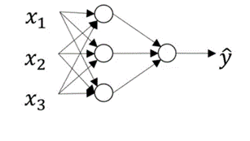

*********************
Overview
*********************

##################
##################
.. contents::
  :local:
  :depth: 3
  
----------
Overview
----------
A neural network is a system that consists of layers of nodes which activate at various levels dependent on previous layer’s nodes. This system is a set of algorithms designed to recognize patterns by interpreting data such as images, sounds, text, or time to be processed and produce an output. Neural networks are differ from logistic regression in that the “weight” of input values are calculated more than once between the different layers of the neural network and not only calculated once like. A simple neural network is shown in the figure below.

--------------
Representation
--------------
The figure below describes a very simple and basic 2 layer neural network. There is an input layer where the dataset is passed into a hidden layer. In the hidden layer different “weights” are added to the inputs and those values are passed to the output layer where the response  ŷ is computed and returned. While in the figure below there is only one hidden layer it is possible to have more than one hidden layer. Using more hidden layers can allow the neural networks to create more accurate predictions with less loss, however then can require more computation.

.. figure:: _img/representation.jpg

-----------
References
-----------
https://www.coursera.org/
