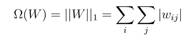
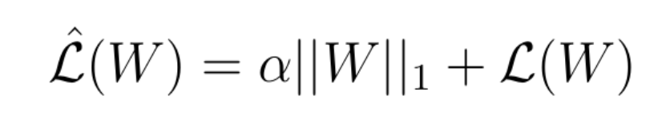

*********************
Regularization
*********************

**Regularization** is the practice in deep learning of reducing the complexity of a neural network while training in order to reduce the problem of overfitting. There are three main regularization techniques used to lower the complexity of the neural network: L1, L2 and dropout(which will be discussed in the next section). Before we cover any regularization methods we first must cover overfitting.

##################
##################
.. contents::
  :local:
  :depth: 2
  
  
------------
Overfitting
------------

**Overfitting** takes place when the neural network picks up on unwanted “noise” in the training data which causes the network to be less accurate when given different data from the same problem set. In simpler terms the neural network is finding patterns or traits in the data that we do not want to be used in it’s calculations. The most common cause of overfitting is building a neural network that is too complex for the task assigned. When the neural network is too complex it will pick up on patterns that are caused by randomness in the data. To fix the problem of overfitting **regularization** is used.

-------------------
L1 Regularization
-------------------

**L1 regularization** makes use of the “regularization term” or Euclidean Norm of the weight matrices denoted as Ω. Ω is the sum of all the absolute weight values of a weight matrix. This function is shown below.

Using the scalar α we create a new loss function shown below. α is defined as the regularization rate, in other words α is used to determine how much we plan to regularize the model.

Taking the updated loss function and computing the gradient we can update the weights for the model. This can be seen in the figure below.

.. figure:: _img/L1.3.PNG

L1 regularization works by pulling the weight values in proportion to their absolute value to reduce the effect of having too high of weight values.

